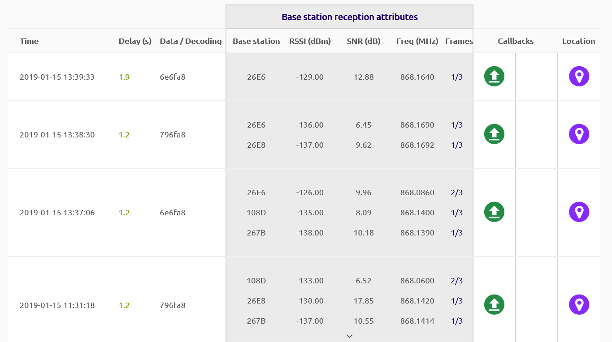
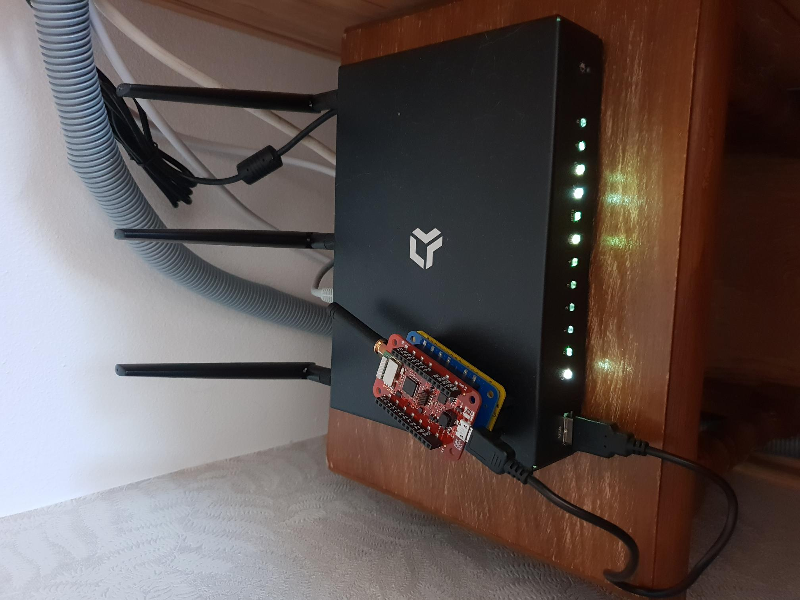

# Power and connectivity alarm

In many areas you need to know if electric power or internet connectivity is available. For example if you run food store you want to know if electric power is available. If not your fridges doesn't work.

This device sends alarm using [Sigfox](https://www.sigfox.com/en) network.

## Power
This device monitors avaibility of electric power. Just connect this device to power socket using 5 V DC adapter and if there is no power at power socket it sends message. Message is sent only when power source (power socket vs. battery module) changed.

## Connectivity
You can connect this device to PC and run [ping.py](ping.py) application to chcek if internet is available. It is recommended to modify application for your needs. If you lost connectivity device sends message.

## Message format

1. byte -  0x79 'y' device has power on USB, 0x6E 'n' no power on USB connector
1. byte -  0x6F 'o' connectivity is available, 0x65 'e' no connectivity
1. byte - battery voltage, to get voltage add 100 and divide by 100

### Example __6e6fa8__
__6e__ - running on battery

__6f__ - last infromation about internet connectivity was OK

__a8__ - battery level is 2.68V, (168 + 100) / 100

## Hardware

Device is using [BigClown](https://www.bigclown.com/) hardware. Mini Battery module is working like [UPS](https://en.wikipedia.org/wiki/Uninterruptible_power_supply) so we can send message without electric power from power socket.

* [Core Module](https://shop.bigclown.com/core-module/) or [Core Module NR](https://shop.bigclown.com/core-module-nr/)
* [Mini Battery Module](https://shop.bigclown.com/mini-battery-module/)
* [Sigfox Module](https://shop.bigclown.com/sigfox-module/) if you have Sigfox contract or [Sigfox Module with Subscription of MySigfox Platinum Service for 3 Years](https://shop.bigclown.com/bundle-sigfoxmodule-mysigfoxplatinum3y/) with Sigfox contract 

## Device firmware

You will need to uplod firmaware to Core Module. Use [BigClown Firmware](https://www.bigclown.com/doc/firmware/basic-overview/) instruction.

## Sigfox integration

Use [Sigfox callbacks](https://blog.sigfox.com/create-callback-sigfox-backend/) to integrate with another systems. For example [Microsoft Flow](https://flow.microsoft.com/).

## Possible and recommended changes

* [LoRa Module](https://shop.bigclown.com/lora-module/)
* Change [ping.py](ping.py) to monitor internet connectivity as you need. For example ping your own server.

## License

This project is licensed under the [MIT License](https://opensource.org/licenses/MIT/) - see the [LICENSE](LICENSE) file for details.

